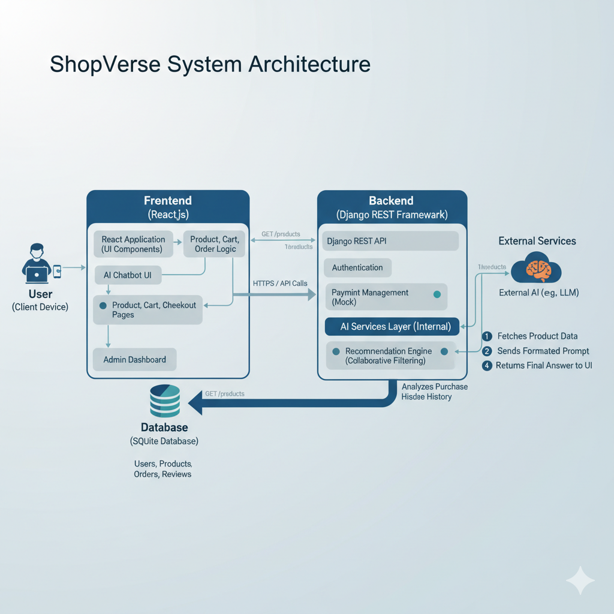

# 🏗️ E-Commerce NeoMart — System Architecture

## 🛍️ Overview

**E-Commerce NeoMart** is a full-stack e-commerce platform that integrates:
- A dynamic **React.js** frontend  
- A robust **Django REST Framework** backend  
- A lightweight **SQLite** database  
- An **AI-powered chatbot** for intelligent product recommendations

This architecture ensures scalability, modularity, and a smooth user experience from browsing to checkout.

---

## 🖼️ Architecture Diagram

Below is the high-level architecture diagram illustrating how each component interacts:

  

---

## 🔁 Architecture Flow

### **1️⃣ Frontend (React.js + Chakra UI)**
- Provides the user interface for shopping, cart management, and checkout.
- Interacts with backend APIs via **Axios** using RESTful endpoints.
- Uses **React Router** for client-side navigation.
- Includes an AI chatbot interface connected to Django’s chatbot API.

---

### **2️⃣ Backend (Django REST Framework)**
- Handles business logic, authentication, and data validation.
- Implements modular apps for **users**, **products**, **orders**, and **chatbot**.
- Uses **JWT (SimpleJWT)** for authentication.
- Generates API documentation via **drf-yasg** (Swagger & ReDoc).

---

### **3️⃣ Database (SQLite)**
- Stores user accounts, products, carts, and order data.
- Managed through **Django ORM**, easily upgradable to PostgreSQL for production.

---

### **4️⃣ AI Chatbot Layer**
- A dedicated Django API endpoint (`/api/chatbot/`) processes user queries.
- Uses product metadata and keyword-based logic for recommendations.
- Can be extended with machine learning (e.g., OpenAI API, scikit-learn models).

---

### **5️⃣ Admin & Analytics**
- Django Admin panel provides control over:
  - Product CRUD operations  
  - Order management  
  - User role handling  
- Extendable with dashboards for analytics and revenue visualization.

---

## ⚙️ Tech Stack Summary

| Layer | Technology | Purpose |
|-------|-------------|----------|
| **Frontend** | React.js, Chakra UI | Dynamic UI, routing, and API integration |
| **Backend** | Django, DRF | RESTful API and business logic |
| **Database** | SQLite | Persistent storage |
| **Auth** | JWT (SimpleJWT) | Secure login/session |
| **AI** | Python NLP / Recommender | Product suggestions and chatbot |
| **Docs** | drf-yasg | Auto API docs |

---

## 📦 Flow Summary

**User Interaction → React Frontend → Django REST API → SQLite Database → AI Chatbot → React UI Update**

This architecture ensures:
- Clean separation of concerns  
- Scalable design for future ML/Payment integrations  
- Extensible API layer for mobile app or third-party use  

---

## 🚀 Future Enhancements

- Integrate **Stripe / Razorpay** for real payments  
- Add **ML-based recommendations** using user history  
- Use **ElasticSearch** for faster search functionality  
- Expand database to **PostgreSQL** in production  
- Implement **real-time notifications** for order updates  

---

> **Author:** Kowshik Bh  
> **Project:** E-Commerce NeoMart  
> **Version:** 1.0.0  
> **Date:** November 2025  
> **License:** MIT
